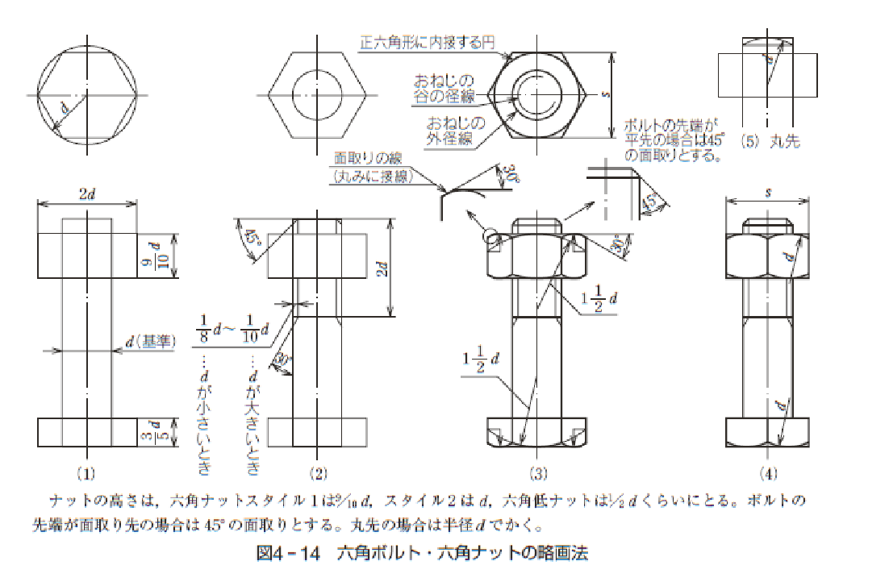
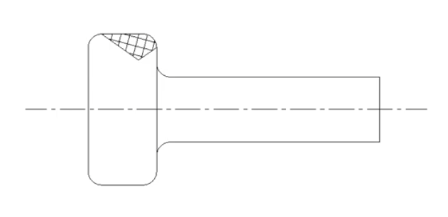
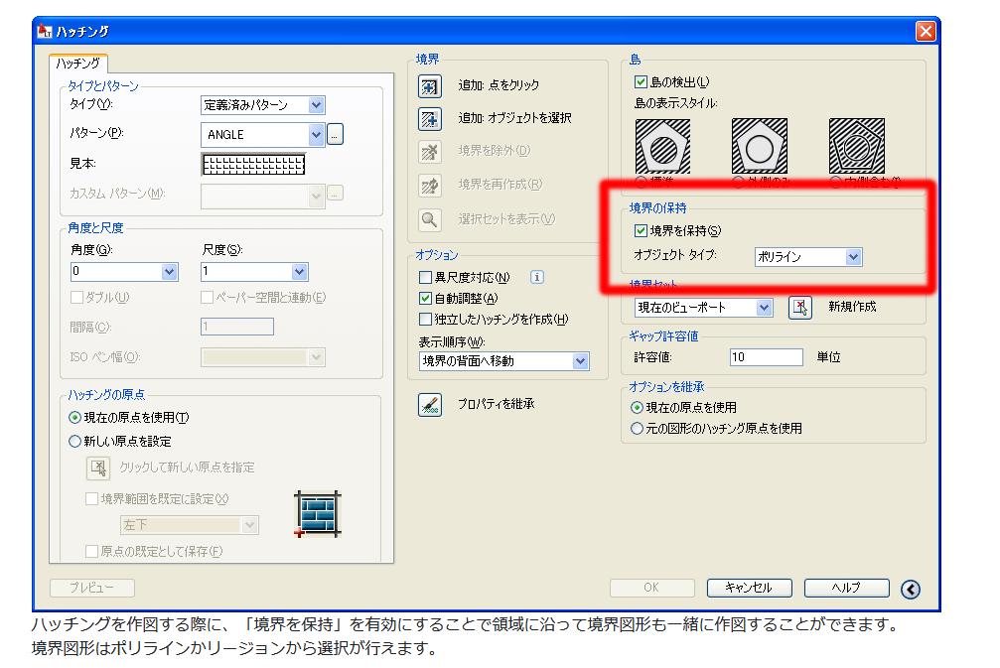
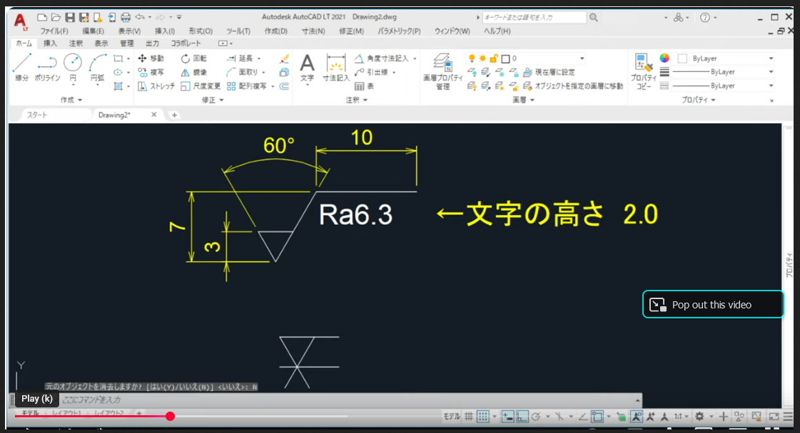
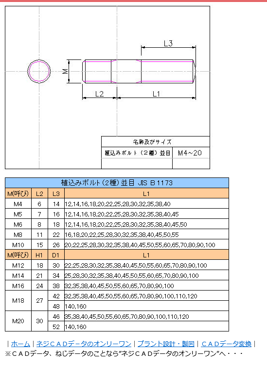

## まとめ

製図ルール
[https://www.noboyu.com/drawing-exam-cheat-sheets/](https://www.noboyu.com/drawing-exam-cheat-sheets/)

## 虎の巻

[https://www.noboyu.com/2016-08-24-204250/](https://www.noboyu.com/2016-08-24-204250/)

### 六角ボルト・六角ナットの略画法　or 薄い本

[http://old.es.u-tokai.ac.jp/es_hp2013/drawing/pdf/2017text.pdf](http://old.es.u-tokai.ac.jp/es_hp2013/drawing/pdf/2017text.pdf)

### 円弧と円弧をつなぐ

工業702 機械製図 高校教科書 工業科用 実教出版 **23ページ参照** 
[https://www.amazon.co.jp/dp/4407204370](https://www.amazon.co.jp/dp/4407204370)

### ねじ

[https://d-engineer.com/seizu/neji.html](https://d-engineer.com/seizu/neji.html)

[https://www.youtube.com/watch?v=wpPAqQncpAM&t=862s](https://www.youtube.com/watch?v=wpPAqQncpAM&t=862s)

### 埋め込みボルト

https://detail.chiebukuro.yahoo.co.jp/qa/question_detail/q11207575896

頭の部分

https://detail.chiebukuro.yahoo.co.jp/qa/question_detail/q10245045205

### ローレット入力

https://www.youtube.com/watch?v=r5T36hIuILg

#### ハッチング　周囲

### 幾何公差入力

https://www.youtube.com/watch?v=IyGGcIIqXZg

### 表面性状

[https://www.youtube.com/watch?v=SSgp58sfMG8](https://www.youtube.com/watch?v=SSgp58sfMG8)

https://engineer-education.com/mechanical-drawing-s01_surface-property/

### 線をn分割

https://www.autodesk.com/jp/support/technical/article/caas/sfdcarticles/sfdcarticles/kA93g000000XfRx.html

### 参考動画

[https://www.youtube.com/@cad.channel](https://www.youtube.com/@cad.channel)

### 提出前チェックリスト

* [ ] テキストや文字体
  * フォントサイズ（ポイント数）、高さを統一する(3.5とか2.5とか)
* [ ] 寸法を入れる 寸法線　[https://d-engineer.com/seizu/sunpoukinyuu2.html](https://d-engineer.com/seizu/sunpoukinyuu2.html)
  
      
* [ ] 線　[https://d-engineer.com/seizu/seizusen.html](https://d-engineer.com/seizu/seizusen.html)
  * 線種

    工業702 機械製図 高校教科書 工業科用 実教出版 **19ページ参照** 
    [https://www.amazon.co.jp/dp/4407204370](https://www.amazon.co.jp/dp/4407204370)     

* [ ] 寸法補助記号 [https://d-engineer.com/seizu/sunpouhojyo.html](https://d-engineer.com/seizu/sunpouhojyo.html)
* [ ] ねじ　[https://d-engineer.com/seizu/neji.html](https://d-engineer.com/seizu/neji.html)

### NG

  * 線をまたがないようにする

    

----

### 未整理

ものづくり太郎

ロボット需要爆発！？安川もファナックも気が付いていない！ 
https://www.youtube.com/watch?v=dL7xIc7n0eI

AIは匠の技術を超越するのか？ （切削) 
https://www.youtube.com/watch?v=s9mDJeyBLwA 

後５年で老人は侮蔑の対象になる。  
https://www.youtube.com/watch?v=byiw9ElJmfA
